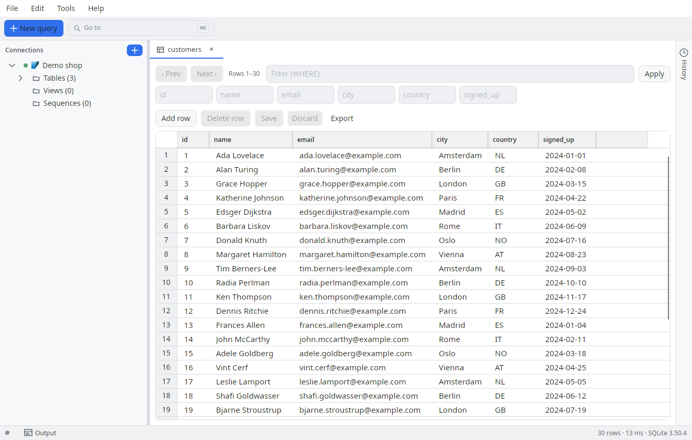
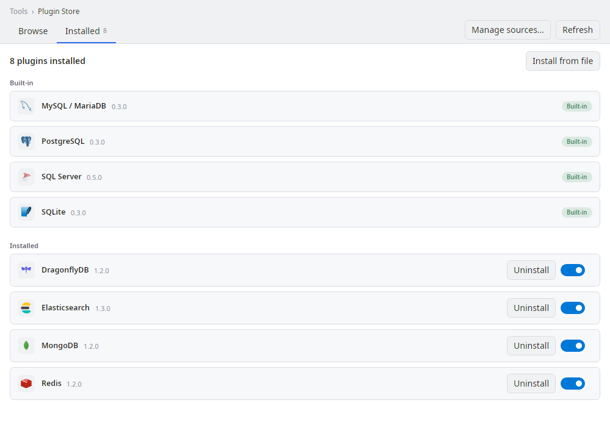

# SQL Explorer

A cross-platform, multilingual SQL explorer built in .NET. Database drivers ship
as plugins, result sets are editable with a reviewable save flow, and connections
are managed with OS-keychain credential storage.

Desktop (Windows / Linux / macOS) is the current focus; mobile heads
(Android / iOS / iPadOS) are intentionally parked.

## Screenshots

Browsing a table with the editable result grid — all data shown is synthetic:



Every database engine ships as a plugin; the Plugin Store manages them:



> Screenshots are rendered headlessly from the real app (no display, no real database) by
> [`SqlExplorer.Screenshots`](src/SqlExplorer.Screenshots) — regenerate with `tools/screenshots.sh`.

## Project layout

| Project | Role |
|---------|------|
| `src/Provider.Sdk` | **Public contract** (`SqlExplorer.Sdk`): `IDbProvider`, `ISqlDialect`, schema/query DTOs. Interfaces and DTOs only — no host internals. This is the only assembly external providers reference. **MIT-licensed** (see below). |
| `src/Core` | Host domain: formatter, i18n seam, provider registry, edit models. No UI, no driver dependencies. References `Provider.Sdk`. |
| `src/Providers.Postgres` | `IDbProvider` for PostgreSQL (Npgsql). **References only `Provider.Sdk`** — proof that a provider builds independently of the host. |
| `src/App` | Avalonia UI (MVVM, CommunityToolkit.Mvvm): views, view models, resx localization, DI. Platform-agnostic. |
| `src/Desktop` | Desktop head (Windows / Linux / macOS). |

A new database = a new `Providers.*` project that references only `Provider.Sdk`.
No UI change, no Core dependency.

## Build & run (desktop)

```bash
dotnet build
dotnet run --project src/Desktop
```

## Features

- Solution builds cleanly across Core / Provider.Sdk / Providers.* / App / Desktop.
- **Providers as ALC plugins** (PostgreSQL + SQLite + MySQL/MariaDB + SQL Server),
  loaded from `plugins/<id>/` — the host binaries carry no driver dependencies.
- Connect and browse a **lazy schema tree** (server → database → schema →
  tables/views → columns, DBeaver-style).
- **Tabs**: multiple query and browse panes open at once.
- **Query tab**: SQL pane (AvaloniaEdit, syntax highlighting) with a
  dialect-aware format button.
- **Browse tab** (double-click a table): page through rows without writing SQL —
  paging (previous/next), a WHERE filter and column-header sort (server-side
  ORDER BY). Editable, with the same save flow.
- Result grid with **dynamic columns** per result set.
- **Editable result set + save flow**: edit cells, add or delete rows; Save shows
  the generated INSERT/UPDATE/DELETE for review and runs them in a single
  transaction. Enabled only when the result traces back to a single table with a
  primary key (otherwise read-only, with the reason shown).
- Connection management with **secure credential storage** (OS keychain via
  `ISecretStore`).
- **Runtime language switch** NL ⇄ EN (resx + `ILocalizer`).

## Not yet (roadmap)

- **Mobile heads** (Android / iOS / iPadOS): separate head projects requiring
  `dotnet workload install android` / `ios` plus a macOS runner for iOS signing.
- **Per-dialect SQL formatter** (currently a generic baseline).

## Conventions

C#: file-scoped namespaces, nullable enabled, Allman braces, primary
constructors, `Async` suffix, `ct` as the last parameter.

## Contributing

Contributions are welcome, but the bar is high for a one-person project. **Read
[`CONTRIBUTING.md`](CONTRIBUTING.md) before opening a pull request** — it covers the PR policy,
coding conventions, the plugin boundary for adding a database, commit style and the changelog flow.

- **Bugs or feature requests:** [open an issue](https://github.com/Lionear/SqlExplorer/issues).
- **Adding a database or tool:** it's a plugin, not a host change — see [`docs/PLUGINS.md`](docs/PLUGINS.md).
- **What changed between releases:** [`CHANGELOG.md`](CHANGELOG.md).

By participating you agree to the [Code of Conduct](CODE_OF_CONDUCT.md).

## License

This project is **source-available**, split across two licenses:

- **`src/Provider.Sdk`** — [MIT](src/Provider.Sdk/LICENSE). The public plugin
  contract is permissively licensed so anyone can build and distribute their own
  database providers freely.
- **Everything else** (App, Core, Desktop, Providers.*) —
  [Apache-2.0 with the Commons Clause](LICENSE). You may use, modify, and share
  it freely, **including for internal business use**. You may **not sell** it —
  the Commons Clause removes the right to sell the software or to offer a paid
  product or service (including paid hosting or support) whose value derives
  substantially from it. To sell or redistribute commercially, contact
  rick@bonkestoter.com for a separate license.

The bundled open-source dependencies keep their own licenses; the attribution
they require lives in [THIRD-PARTY-NOTICES.md](THIRD-PARTY-NOTICES.md), which
ships alongside the binaries. It is generated from the NuGet dependency closure
by `tools/generate-third-party-notices.py` — re-run that after changing
dependencies (`--check` verifies the committed file is current).
